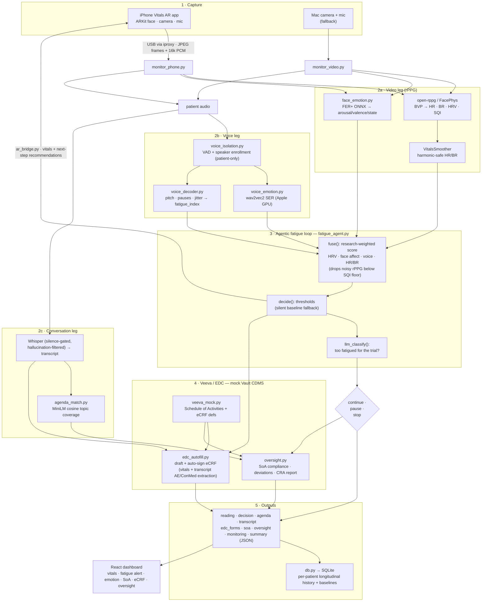

# Contactless Clinical-Trial Vitals & Fatigue Monitor

Reads a patient's **heart rate, breathing, HRV, emotional state and fatigue** from a
face video + voice — no wearable — decides whether they're **too fatigued to continue
a trial visit**, and integrates with the trial's **Schedule of Activities + EDC (Veeva
Vault CDMS-shaped)**: it suggests what still needs covering, auto-fills & signs the
eCRF from what it sees and hears, and runs **automated protocol oversight** so no
separate monitor is needed.

The iPhone (Vitals AR app) is the sensor and the AR overlay; the Mac runs the model
pipeline; a web dashboard shows everything live.

## Whole pipeline



## How it adheres to the original plan

The whiteboard was: **video → open rPPG** and **voice → voice decoder** produce
**biometrics (BR, HR, fatigue, emotional state)**, made **context-aware**, fed to an
**agentic loop that classifies fatigue** → **"too fatigued?"** decision. Every node is
implemented:

| Whiteboard node | Implementation |
|---|---|
| video → open RPPG | `monitor_video.py` / `monitor_phone.py` + open-rppg → HR/BR/HRV/SQI |
| voice → voice decoder | `voice_isolation.py` + `voice_emotion.py` + `voice_decoder.py` |
| biometrics: BR · HR · fatigue | rPPG vitals + `fatigue_agent.py` fatigue score |
| emotional state | `face_emotion.py` (video) + wav2vec2 SER (voice) |
| context aware | conversation transcript + agenda coverage + oversight guidance |
| agentic loop → classify fatigue | `fatigue_agent.py` fuse → decide → `llm_classify` |
| too fatigued? (yes → stop / no → loop) | `trial_recommendation`: continue / pause / stop |

Beyond the original plan (from the Regeneron conversation): **Veeva SoA/EDC
integration**, **auto-filled & signed eCRF**, and **automated clinical oversight**.

## Run it

```bash
./setup_envs.sh                      # once: conda envs + deps
CAMERA=1 ./monitor.sh --veeva --agenda   # Mac camera + full pipeline
./monitor.sh --phone --veeva --agenda    # iPhone AR app as the sensor (over USB)
./monitor.sh --stop
python demo_override.py              # hardcoded demo scenario (distressed patient)
```

Dashboard: `cd vitals-dashboard && npm run dev` → `localhost:5199` → **Go live**.
iOS app: `vitals-ar-ios/` (build/install via Xcode or `devicectl`).

> Two conda envs: `rppg` (video) and `papagei_env` (voice / agent / EDC / AR bridge).
> Secrets live in a gitignored `.env` (`OPENAI_API_KEY`); patient DB and runtime
> outputs are gitignored too. Contactless estimates — not medical grade.
